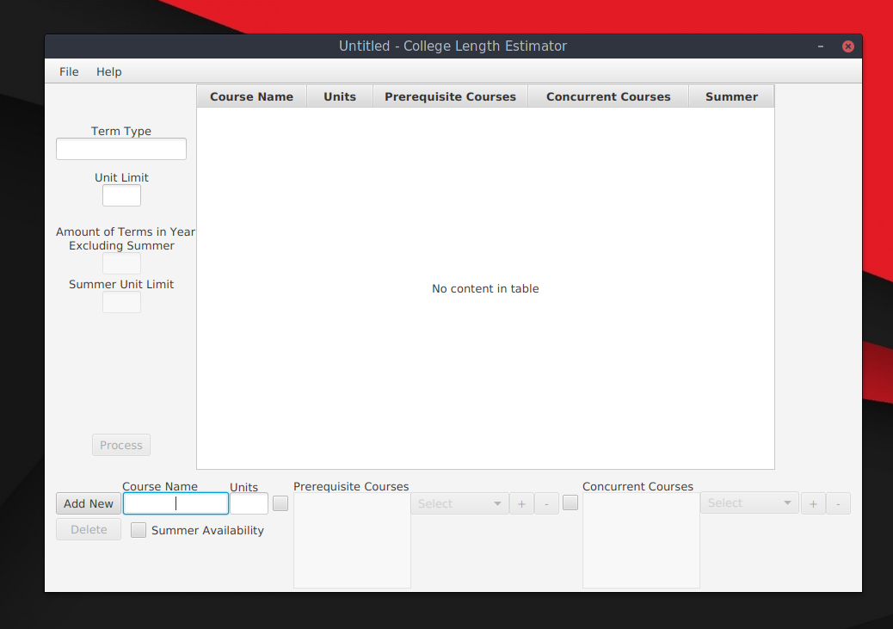

# College Length Estimator (CLE)
Ever wondered how long it would take you to complete college? Are you done exploring results like [these](https://www.google.com/webhp?sourceid=chrome-instant&ion=1&espv=2&ie=UTF-8#q=how+long+will+it+take+for+me+to+complete+college) to figure it out? Want an answer that actually means something for you?

The College Length Estimator (CLE) is a program I've been working on for two years (two months for the GUI version with help from a friend) that gives the user an estimate on how long it would take for them to complete a set number of courses under ideal conditions. 

## Features
- Specify the Term Type (For example: Semester, Quarter, etc)
- Define how many of that term are in a year excluding summer. (Such as for a Semester, 2, and for a Quarter, 3)
- Enforce a unit limit for both normal and summer terms.
- Adding courses with prerequisites and concurrents with real-time changes reflected on the table.
- Sort table elements by the provided course information.
- Provides a report in a .txt by default that is different every time when processed on how many terms it require to complete the courses given.
- Able to include additional information for summer courses in summer terms in the report.
- Capable of making new files, opening existing ones, as well as saving current data in .dat files.

## Installing
This program requires the latest version of Java. You can get that [here](https://java.com/en/download/). For users who are using OpenJDK, you may need to download OpenJFX, which acquiring that varies based upon the distribution being used. 

You can either download the latest version from the [releases page](https://github.com/divark/CLE/releases), or download the repository and compile the source files by any preferrable means.

## Disclaimer
This program can not (and should not) replace the role of college counselors and similar individuals. This only provides a report based on the information given by the user without any awareness of the course's availability from the college itself.
